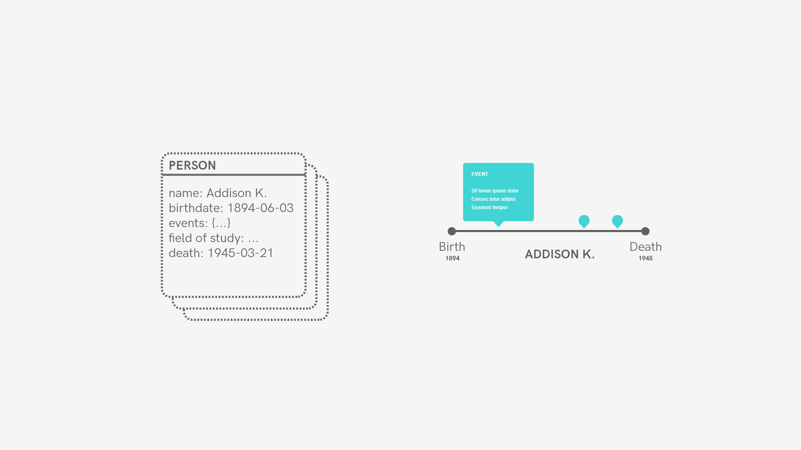
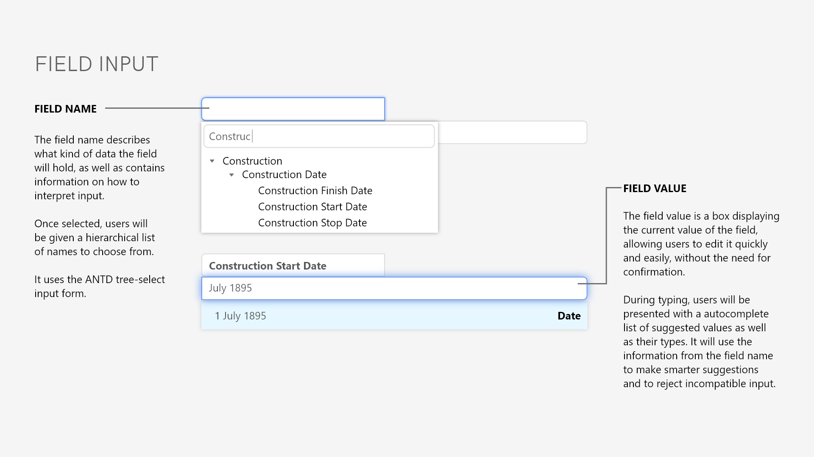
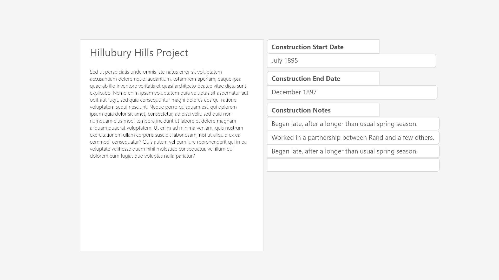

# Amaranthus (Working Title)

'Amaranthus' is a document database and reference tool focused on 
intelligent cross-referencing, data visualisation, flexibility, and 
transparency.

It uses simple flat file serialisation in JSON to store 
information in a way that is both readable and accessible, but also allows 
for aggregation, processing and searching; hopefully the good parts 
of both worlds.

Currently, it uses [NodeJS](https://nodejs.org/en/) to host a 
local server on the user's
machine, serving a web interface that allows them to input
and modify data, following a similar approach to that of 
[Jupyter](http://jupyter.org/).

The advantages I can see of this approach are as follows:

1. I get to leverage the power of web applications, allowing for 
more custom inputs, display and UX, *critically* without needing
to download a fresh version of Chromium to run Electron. I need
to assume that the user has a modern browser that can handle the
web application aspect of the program, but I can take that assumption.

2. I get to handle data processing and other non-user facing
code separately in a server processes, allowing me to isolate 
the two workflows. This means I can modify the interface 
component quickly without worrying about breaking the back
end, as long as I leave the AJAX request structure alone.
    
    - It also means I get a lot of the asynchronous and 
    non-blocking power from Node relatively easily. I can
    run processes for storing and organising data in the 
    server without slowing down the user experience.

3. I get to use NPM to accelerate development with the use
of well maintained libraries.

I'm also taking the opportunity of developing this software
to learn more about new web development methods like SSR,
Single Page Applications, React, and AJAX.

## DESIGN

### Problem statement:

How might we organise and store information so that it can be visualised 
easily? How might we store this information easily and quickly.

### Target audience/use cases:

* Academics
* Visualisations
* Research

### Design priorities:

1. Fast and easy.
2. Flexible, requiring as little upkeep as possible.
3. Open and transparent, avoid data lock-in using flat file.

## PRIORITIES

### Fast and Easy

The system should be able to interpret complex objects using simple parsing, an "author"
field should not require the user to input the last name and first name separately. Instead,
the user should be able to type generic input into a general text field and have 
the result cast into the appropriate type.

### Flexible

Despite being a web-based program, the program should be solid
and reliable without the need for external, changing dependencies.

In this sense it should function like a desktop application. No 
matter where or when the program is run, it should be able to
function correctly.

The challenge on this priority will be in using an application
component that's resilient to changes in the users browser.

### Open and Transparent

Users should have complete and open access to the data they 
create while using the application. It should be easily
convertible to different formats for interoperability and 
stored cleanly and well structured on the users file system.

...